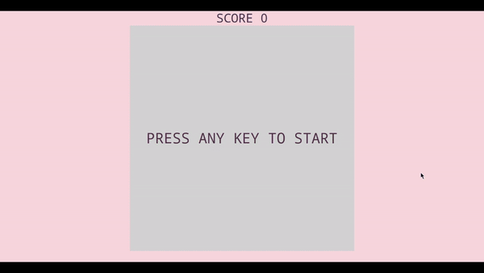

# Snake Game

This is a simple snake game implemented in C# as a programming exercise. The game is developed using WPF in Microsoft Visual Studio, showcasing basic game development in a desktop application.


## Getting Started

### Prerequisites

To run this project, you will need:

- Microsoft Visual Studio
- .NET Framework (as required by WPF)

### Installation

1. Clone the repository to your local machine using Git:
   ```bash
   git clone https://github.com/Meriiem/snake-game.git

2. Open the solution file (`SnakeGame.sln`) in Microsoft Visual Studio.
3. Build and run the application by pressing `F5` or clicking on the `Start` button in Visual Studio.
4. If the `bin` and `obj` folders are missing, don't worry. Visual Studio will regenerate them when you build the project.

## How to Play

- Use the arrow keys to move the snake around the screen.
- Collect food to increase the length of the snake.
- Avoid colliding with the walls or the snake's own tail.
